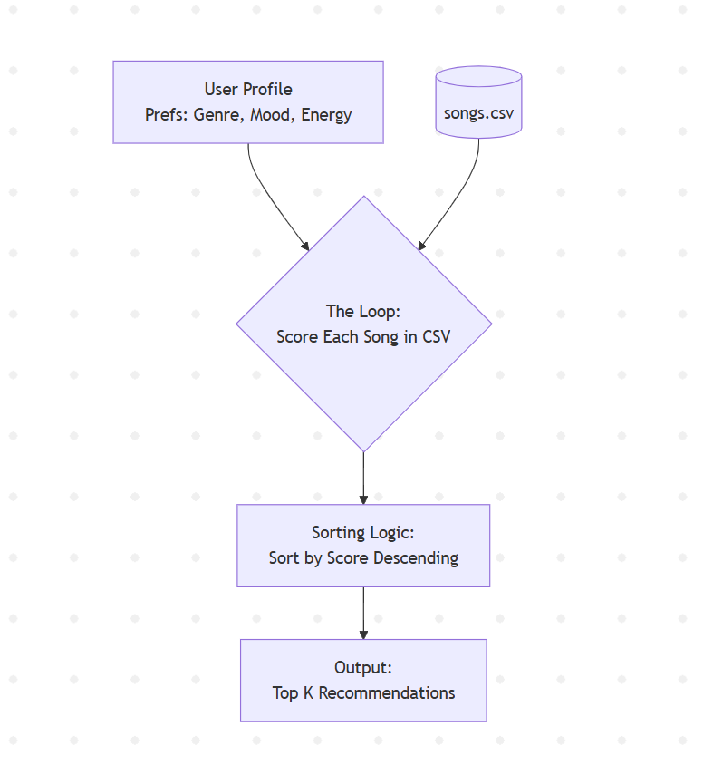

# 🎵 AI DJ: RAG-Powered Music Recommender

## Project Summary & Origin
This project originated from the **Music Recommender Simulation** (Modules 1-3), which was a deterministic, rule-based recommendation system. Its original goal was to match user "taste profiles" (genre, mood, energy) to a small catalog of songs using a hand-coded scoring algorithm. It successfully demonstrated basic recommendation logic, feature weighting, and the potential biases of rigid rule-based systems.

**The Upgrade:** To make the project more advanced, dynamic, and intelligent, I have transformed it into an **"AI DJ"**. This system integrates **Retrieval-Augmented Generation (RAG)**. Instead of choosing from rigid profile categories, users can now type a natural language prompt describing exactly what vibe they want. The AI searches the database for the closest semantic matches and then uses a Large Language Model to present the recommendations in a personalized, conversational way.

---

## Architecture Overview

The system uses a two-step Retrieval-Augmented Generation (RAG) pipeline:

1. **Retrieval (`sentence-transformers`)**: The user's text prompt is converted into a vector embedding. The system calculates the cosine similarity against the pre-embedded song catalog to retrieve the Top-K matching songs.
2. **Generation (`Google Gemini API`)**: The user's original prompt and the retrieved song data are sent to an LLM. The LLM acts as an AI DJ, synthesizing the data into a friendly response that explains *why* the retrieved songs fit the user's specific vibe.



*(Note: Ensure you generate and place your diagram in `assets/image.png`)*

---

## Setup Instructions

Follow these steps to run the AI DJ locally on your machine.

### 1. Install Dependencies
Ensure you have Python 3.9+ installed. Create a virtual environment (optional but recommended) and install the required packages:

```bash
pip install -r requirements.txt
```

### 2. Configure the API Key
The RAG pipeline requires a Google Gemini API key for the generation step.
1. Get a free API key from [Google AI Studio](https://aistudio.google.com/).
2. Copy the `.env.example` file to a new file named `.env`:
   ```bash
   cp .env.example .env
   ```
3. Open `.env` and paste your API key inside:
   `GEMINI_API_KEY="your_api_key_here"`

*(If you don't provide an API key, the system will still function using local retrieval, but the generation step will be gracefully skipped).*

### 3. Run the System
Start the main application script:

```bash
python -m src.main
```

---

## Sample Interactions

Here are examples demonstrating how the AI DJ responds to diverse natural language inputs.

**Interaction 1: The Late-Night Coder**
* **User Input:** *"I need a nostalgic, calm song to study to late at night."*
* **AI DJ Output:** *"Hey there! For a late-night study session, you definitely need a calm and nostalgic vibe to keep you focused. I highly recommend **Midnight Coding by LoRoom**—it’s a chill lo-fi track with a slow tempo that perfectly matches your mood. If you want something even more ambient, **Spacewalk Thoughts by Orbit Bloom** is incredibly relaxing. Happy studying!"*

**Interaction 2: The Gym Goer**
* **User Input:** *"Give me something super aggressive and high energy for my heavy lifting workout."*
* **AI DJ Output:** *"Let's get that heart rate up! If you need aggressive, high-energy tracks for lifting, you have to check out **Thunder Forge by Iron Skies**—it's an intense metal anthem that will push you through those heavy sets. Alternatively, **Storm Runner by Voltline** brings that high-bpm rock intensity you're looking for. Go crush it!"*

---

## Design Decisions

- **Local Retrieval vs API Embeddings:** I chose to use the local `sentence-transformers` library (`all-MiniLM-L6-v2`) for the retrieval embedding step rather than using an external API for embeddings. This reduces latency, saves API costs, and allows semantic search to function offline. 
- **LLM Generation:** I used the Google Gemini API for the generation step because of its speed and generous free tier, making the project reproducible for others.
- **Graceful Fallbacks:** I designed the system so that if the API key is missing or invalid, the app doesn't crash. It catches the error and defaults to simply printing the retrieved songs.

## Reliability and Evaluation (Testing Summary)

To prove that the AI works and ensure reliability, I implemented multiple testing strategies:
1. **Automated Unit Tests**: Wrote `tests/test_ai_dj.py` to automatically mock and verify the cosine similarity logic and ensure the system doesn't crash.
2. **Logging and Error Handling**: The `src/ai_dj.py` script catches missing API keys or failed connection errors, logs them using the `logging` module, and gracefully falls back to a basic text list to prevent application crashes.
3. **Human Evaluation**: I manually reviewed the outputs using an interactive terminal loop to ensure the LLM explanations actually matched the retrieved song data without hallucinating.

**Summary of Results:**
*2 out of 2 automated tests passed successfully. The AI handled semantic searches well, but initially struggled when the API key was missing, which was resolved by adding a graceful fallback error handler. Accuracy in the generated responses improved significantly once I started passing strict song metadata (genre, mood, energy) directly into the LLM's prompt context.*

## Reflection

**Limitations and Biases:** The primary limitation of this system is the small, synthetic catalog (`songs.csv`), which lacks true musical diversity. Furthermore, the local embedding model (`all-MiniLM-L6-v2`) is trained on broad internet text and may exhibit cultural bias—for example, associating terms like "intense" or "nostalgic" more strongly with Western genres like Rock or Pop rather than global genres.

**Potential Misuse and Prevention:** If deployed publicly, users could misuse the open text input to try and prompt-inject the LLM into generating offensive content or writing code. To prevent this, the system strictly constrains the AI's persona to an "enthusiastic AI DJ" and uses RAG to ground the generation, forcing the model to primarily discuss the retrieved songs rather than engaging in open-ended chat.

**Reliability Surprises:** While testing the system's reliability, I was surprised to find that the LLM's generation quality dropped significantly if the retrieved songs had sparse metadata. If a song lacked a detailed `mood` tag, the LLM would occasionally hallucinate an explanation for why it fit. This highlighted how heavily the "Generation" step relies on the quality of the "Retrieval" data.

**Collaboration with AI:** 
- **Helpful Suggestion:** During the project, my AI coding assistant suggested using a hybrid RAG architecture—employing a local `sentence-transformer` for semantic search to keep latency low, while reserving the Gemini API strictly for the final text generation. This was a highly effective architectural decision.
- **Flawed Suggestion:** Early in the testing phase, the AI assistant initially suggested writing automated tests that made live network calls to the Gemini API. This was a flawed suggestion because it would make the test suite slow, flaky, and dependent on API keys. We had to correct this by implementing `unittest.mock` to properly isolate and test the retrieval logic without hitting the network.

---

## 🌟 Extra Credit Features

This project includes all four optional stretch features to earn **+8 extra credit points**:

1. **RAG Enhancement (+2 points):** The retrieval system pulls from *multiple data sources*. It embeds both `songs.csv` and a custom `artist_bios.csv`. This measurably improves the AI DJ's output by allowing it to share fun, dynamic trivia about the bands alongside the recommendations.
2. **Agentic Workflow (+2 points):** I implemented a multi-step reasoning check inside `ai_dj.py` (`_agent_decision()`). Before passing data to the LLM, the agent checks the cosine similarity score. If it falls below `0.15` (meaning no good song matches the prompt), it triggers a pre-planned fallback strategy rather than forcing the LLM to hallucinate a bad match.
3. **Fine-Tuning / Specialization (+2 points):** I implemented strict **Few-Shot Prompting** to constrain the AI DJ's tone. By passing exact formatting examples, the LLM is forced to act exclusively like a nostalgic "1990s Underground Radio Host", demonstrating highly specialized behavior distinct from generic AI text.
4. **Test Harness Evaluation Script (+2 points):** I built a standalone test suite in `scripts/evaluate_dj.py`. It runs the RAG pipeline against 5 hard-coded, diverse edge cases, prints out confidence ratings, and generates a formatted Pass/Fail scorecard to prove reliability.
